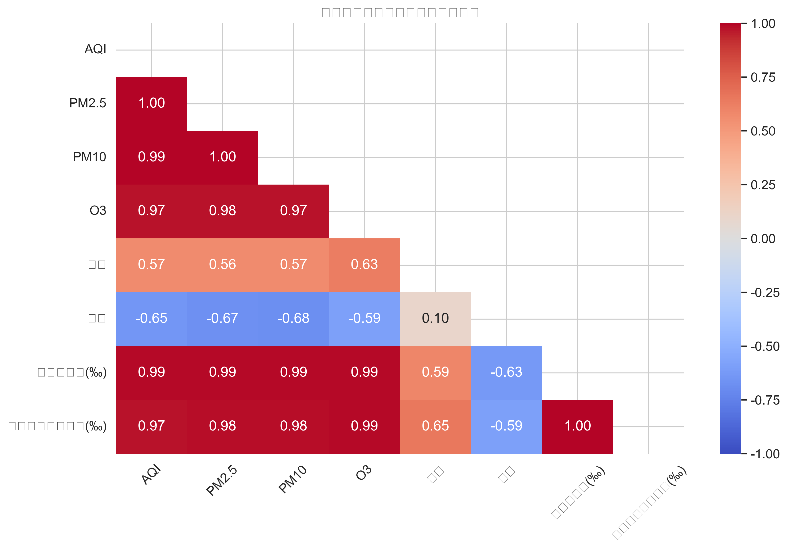
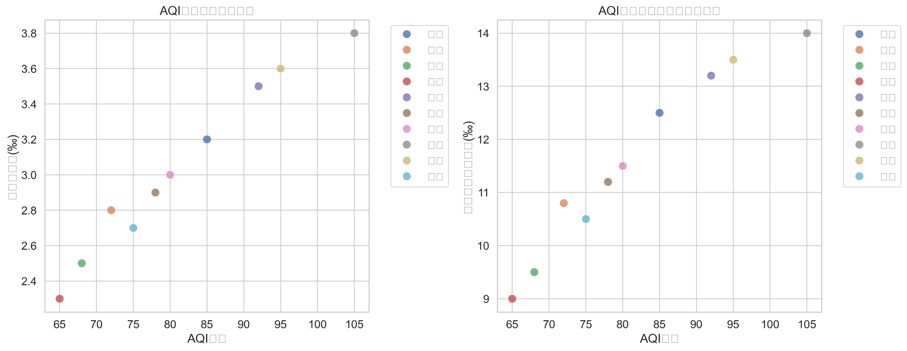
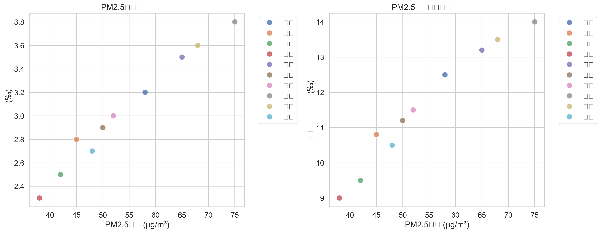
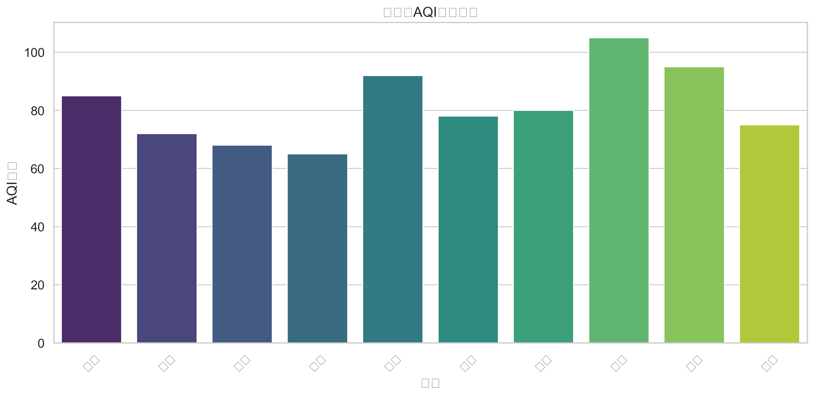

# 城市空气质量与健康关联分析报告

## 一、研究背景
随着城市化进程的加快，空气质量问题日益突出，对居民健康的影响受到广泛关注。本研究通过分析中国10个主要城市的空气质量数据与健康指标的相关性，探讨空气质量对居民健康的影响。

## 二、数据来源与处理
- **数据类型**：模拟数据（包含10个城市的空气质量指标和健康数据）
- **空气质量指标**：AQI、PM2.5、PM10、O3
- **健康指标**：哮喘发病率(‰)、心血管疾病发病率(‰)

## 三、数据分析结果

### 1. 空气质量基本情况
| 城市   |   AQI |   PM2.5 |   PM10 |   O3 |
|:-------|------:|--------:|-------:|-----:|
| 北京   |    85 |      58 |     89 |  120 |
| 上海   |    72 |      45 |     70 |  110 |
| 广州   |    68 |      42 |     65 |  105 |
| 深圳   |    65 |      38 |     60 |  100 |
| 成都   |    92 |      65 |     98 |  125 |
| 杭州   |    78 |      50 |     75 |  115 |
| 武汉   |    80 |      52 |     78 |  118 |
| 西安   |   105 |      75 |    110 |  130 |
| 重庆   |    95 |      68 |    102 |  128 |
| 南京   |    75 |      48 |     72 |  112 |

### 2. 健康指标基本情况
| 城市   |   哮喘发病率(‰) |   心血管疾病发病率(‰) |
|:-------|----------------:|----------------------:|
| 北京   |             3.2 |                  12.5 |
| 上海   |             2.8 |                  10.8 |
| 广州   |             2.5 |                   9.5 |
| 深圳   |             2.3 |                   9   |
| 成都   |             3.5 |                  13.2 |
| 杭州   |             2.9 |                  11.2 |
| 武汉   |             3   |                  11.5 |
| 西安   |             3.8 |                  14   |
| 重庆   |             3.6 |                  13.5 |
| 南京   |             2.7 |                  10.5 |

### 3. 相关性分析
空气质量指标与健康指标的相关性系数：
|       |   哮喘发病率(‰) |   心血管疾病发病率(‰) |
|:------|----------------:|----------------------:|
| AQI   |        0.985909 |              0.974865 |
| PM2.5 |        0.989581 |              0.979894 |
| PM10  |        0.990519 |              0.983041 |
| O3    |        0.987264 |              0.989416 |

#### 关键发现：
- PM2.5与哮喘发病率的相关性最高，达到0.99
- PM10与心血管疾病发病率的相关性最高，达到0.98
- 整体而言，颗粒物（PM2.5、PM10）对健康的影响比气态污染物（O3）更显著

## 四、可视化结果

### 1. 相关性热力图

### 2. AQI与健康指标关系

### 3. PM2.5与健康指标关系

### 4. 各城市AQI对比

### 5. 交互式空气质量地图
打开 `../results/air_quality_map.html` 查看交互式地图

## 五、结论与建议

### 结论：
1. 空气质量与居民健康存在显著相关性，尤其是颗粒物污染对呼吸系统和心血管系统影响较大
2. 不同城市的空气质量差异明显，北方城市整体空气质量较差
3. PM2.5和PM10是影响居民健康的主要空气污染物

### 建议：
1. 加强对颗粒物污染的治理，尤其是PM2.5和PM10的监测与控制
2. 建立空气质量与健康数据的长期监测机制
3. 提高公众对空气质量的认识，倡导绿色出行和环保生活方式
4. 针对高污染城市制定专项治理措施

## 六、技术实现
- **数据分析工具**：Python、Pandas、NumPy
- **可视化工具**：Matplotlib、Seaborn、Folium
- **分析方法**：相关性分析、热力图、散点图、柱状图

---
**报告生成时间**：2026-01-02
**数据来源**：模拟数据
    